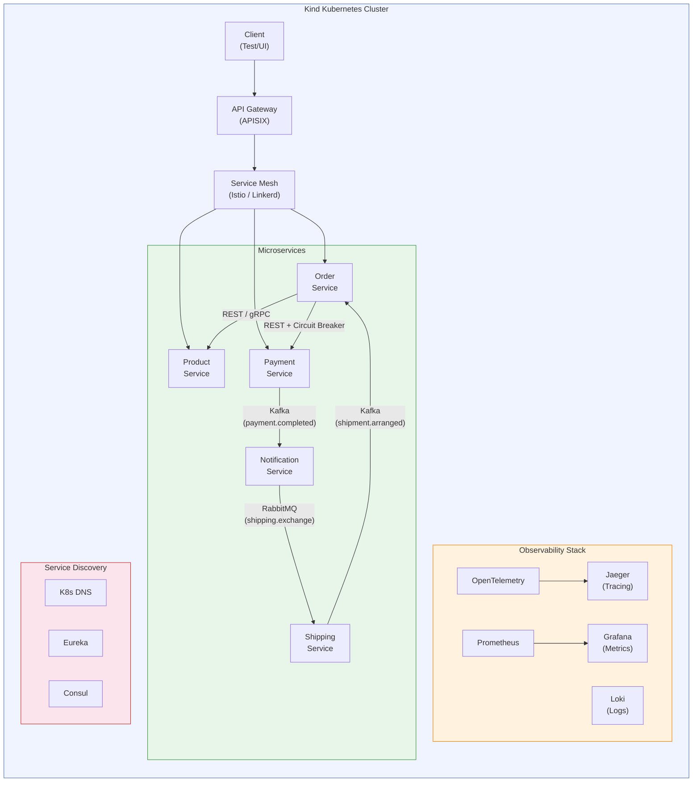
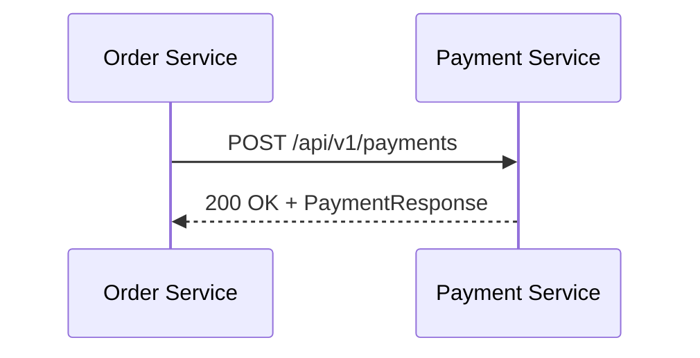
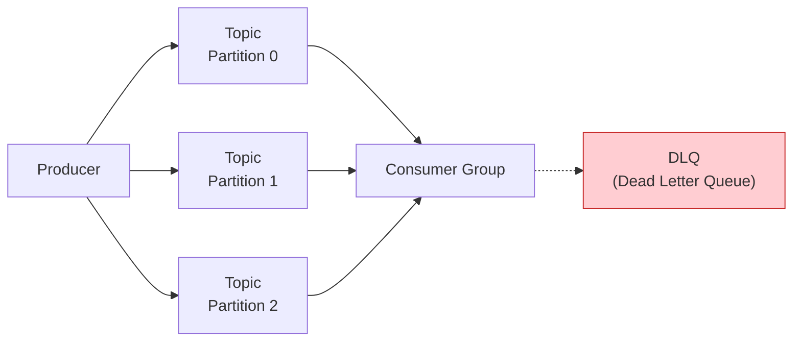
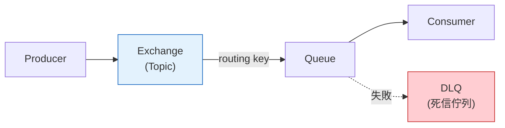
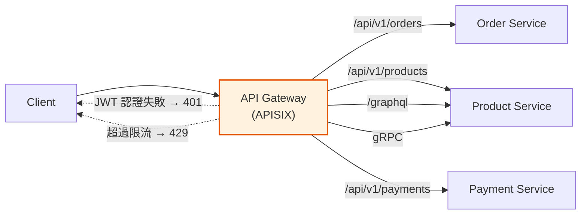
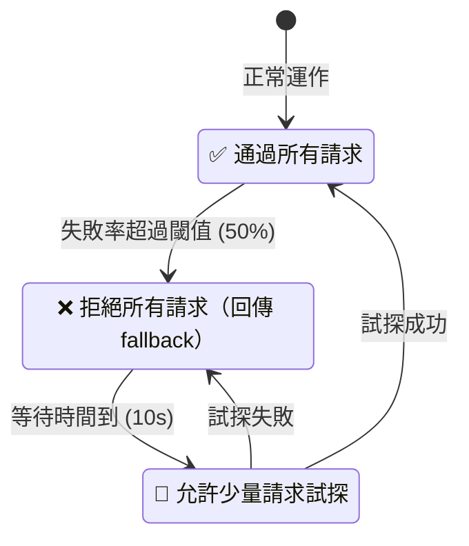
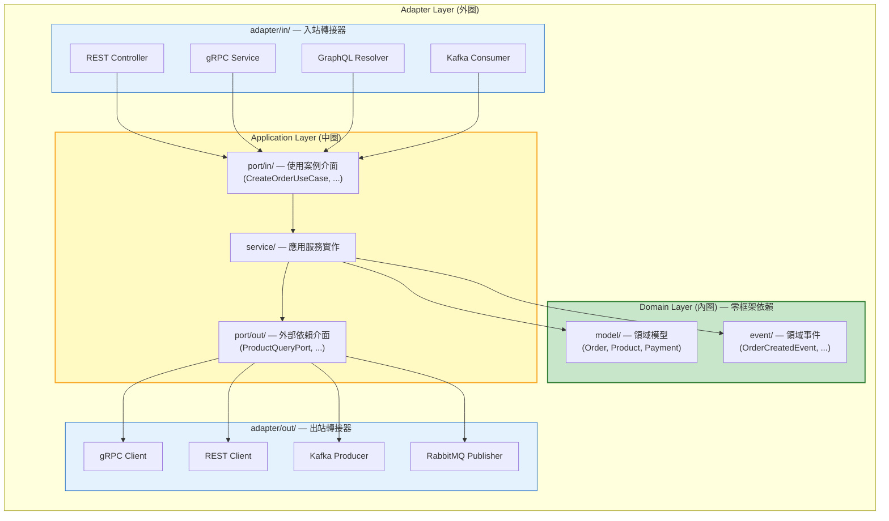
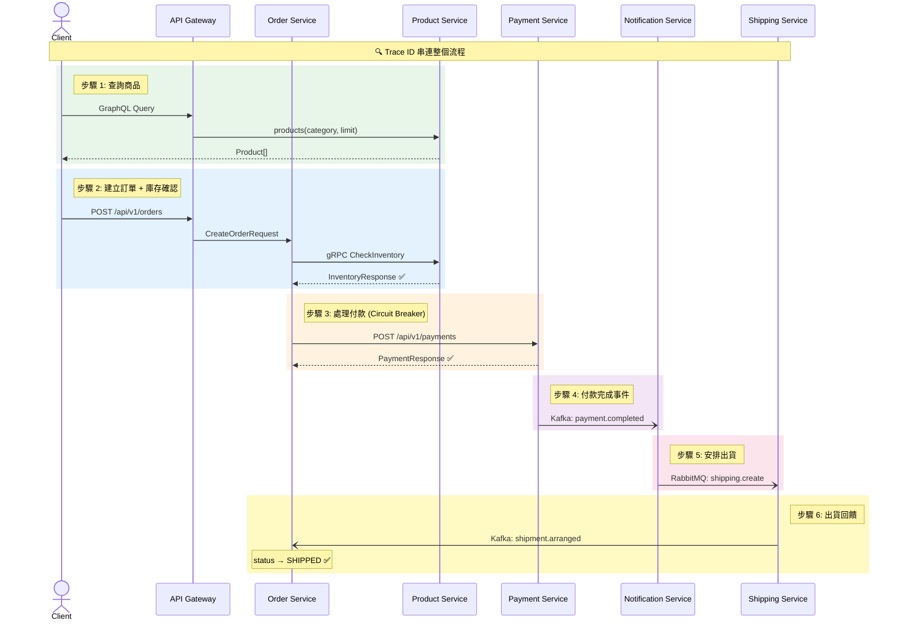
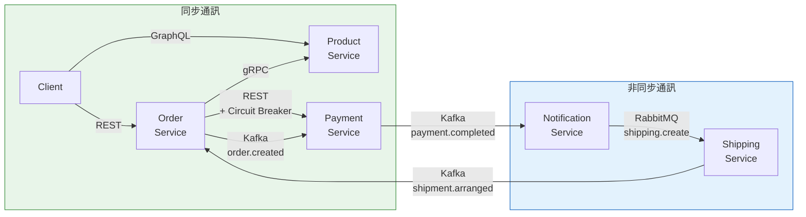
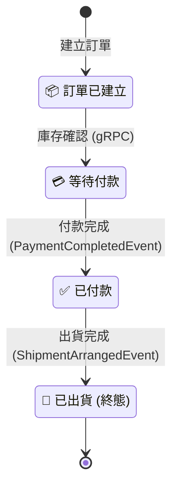

# Service-to-Service Communication PoC

> 微服務間通訊模式的完整概念驗證（Proof of Concept），涵蓋 8 大通訊場景，
> 使用 Java 23 + Spring Boot 4 技術棧，部署在本地 Kind Kubernetes 叢集。

---

## 這個專案在做什麼？

在微服務架構中，服務之間需要互相通訊。但通訊的方式有很多種——有的是即時的（同步），有的是延遲的（非同步）；有的用 JSON，有的用二進位格式。**選擇哪種方式，取決於場景需求。**

本專案用一個簡化的**電子商務訂單處理流程**，實際驗證 8 種常見的服務間通訊模式：

```
顧客下單 → 查詢商品 → 建立訂單 → 處理付款 → 發送通知 → 安排出貨
```

每個步驟使用不同的通訊協定，讓你可以實際比較各種方式的優缺點。

---

## 系統架構



### 5 個微服務

| 服務 | 職責 | 通訊角色 |
|------|------|---------|
| **Order Service** | 訂單管理 | REST 入口 + gRPC 客戶端 + Kafka 生產/消費者 |
| **Product Service** | 商品查詢 | gRPC 伺服器 + GraphQL 端點 + REST 端點 |
| **Payment Service** | 付款處理 | REST 端點 + Kafka 消費/生產者 |
| **Notification Service** | 通知發送 | Kafka 消費者 + RabbitMQ 生產者 |
| **Shipping Service** | 出貨安排 | RabbitMQ 消費者 + Kafka 生產者 |

---

## 8 大通訊模式詳解

### 模式 1：REST（同步 HTTP/JSON）

**什麼是 REST？** REST 是最常見的 Web API 風格。服務之間用 HTTP 協定傳送 JSON 格式的資料，就像瀏覽器跟網站溝通一樣。

**本專案的使用場景：**
- Order Service → Payment Service（處理付款）
- 外部客戶端 → Order Service（建立訂單）

**技術實現：** Spring Boot 4 的 `RestClient`（取代已棄用的 `RestTemplate`）



**適合場景：** 需要即時回應的請求-回應模式，例如付款確認。

---

### 模式 2：gRPC（同步，高效能二進位協定）

**什麼是 gRPC？** Google 開發的高效能通訊協定。使用 Protocol Buffers（Protobuf）做二進位序列化，比 JSON 更小更快。基於 HTTP/2，支援多路複用。

**本專案的使用場景：**
- Order Service → Product Service（查詢庫存）

**技術實現：** `grpc-spring-boot-starter` 3.2.0，透過 `.proto` 檔定義服務契約。

```protobuf
// product.proto — 服務契約定義
service ProductService {
  rpc GetProduct (GetProductRequest) returns (ProductResponse);
  rpc CheckInventory (InventoryRequest) returns (InventoryResponse);
}
```

**適合場景：** 內部服務間高頻率、低延遲的通訊，例如庫存查詢。

---

### 模式 3：GraphQL（同步，彈性查詢）

**什麼是 GraphQL？** Facebook 開發的查詢語言。與 REST 不同，客戶端可以指定要哪些欄位，避免過度取得或不足取得資料。

**本專案的使用場景：**
- 外部客戶端 → Product Service（彈性商品查詢）

**技術實現：** Spring for GraphQL（Spring Boot 4 官方支援）

```graphql
# 客戶端只要 name、price、stock 三個欄位
query {
  products(category: "ELECTRONICS", limit: 5) {
    name
    price
    stock
  }
}
```

**適合場景：** BFF（Backend for Frontend）模式，前端需要靈活取得不同組合的資料。

---

### 模式 4：Kafka（非同步事件串流）

**什麼是 Kafka？** Apache Kafka 是分散式事件串流平台。生產者（Producer）將事件發布到 Topic，消費者（Consumer）訂閱 Topic 接收事件。事件持久化存儲，支援重播。

**本專案的使用場景：**
- Order Service → `order.created` Topic → Payment Service（非同步付款路徑）
- Payment Service → `payment.completed` Topic → Notification Service
- Shipping Service → `shipment.arranged` Topic → Order Service（狀態回饋）

**核心概念：**



- **Topic**：事件的類別（像郵局的信箱）
- **Partition**：Topic 的分區，用 orderId 做 Key 確保同一訂單的事件有序
- **Consumer Group**：一組消費者共同處理一個 Topic，每個分區只會被一個消費者處理
- **DLQ（Dead Letter Queue）**：處理失敗的事件會轉到死信佇列，不會遺失

**適合場景：** 高吞吐量的事件驅動架構，需要事件持久化和重播能力。

---

### 模式 5：RabbitMQ（非同步訊息佇列）

**什麼是 RabbitMQ？** 傳統的訊息佇列中間件，使用 AMQP 協定。與 Kafka 不同，RabbitMQ 更像「郵差」——訊息送達後就從佇列中移除。

**本專案的使用場景：**
- Notification Service → `shipping.exchange` → Shipping Service（安排出貨）

**核心概念：**



- **Exchange**：訊息路由器（本專案用 Topic Exchange）
- **Queue**：訊息存放處
- **Routing Key**：決定訊息送到哪個 Queue
- **ACK（確認機制）**：消費者處理完後回傳確認，確保訊息不遺失

**適合場景：** 點對點的任務分發，需要訊息確認和靈活路由的場景。

---

### 模式 6：API Gateway（統一入口）

**什麼是 API Gateway？** 所有外部請求的統一入口。負責路由、認證、限流等橫切關注點，讓後端服務專注於業務邏輯。

**本專案的使用場景：**
- Apache APISIX 作為所有外部請求的入口

**功能驗證：**



| 功能 | 說明 | 驗證方式 |
|------|------|---------|
| 路由 | `/api/v1/orders` → Order Service | 正確轉發 |
| JWT 認證 | 無效 Token → 401 Unauthorized | 阻擋未授權請求 |
| 限流 | 超過 100 req/s → 429 Too Many Requests | 保護後端服務 |
| gRPC 代理 | gRPC 請求 → Product Service | 支援多協定 |

---

### 模式 7：Service Discovery（服務發現）

**什麼是 Service Discovery？** 讓服務可以動態找到彼此，不需要寫死對方的 IP 地址。當服務啟動或關閉時，會自動註冊或移除。

**本專案驗證三種機制：**

| 機制 | 類型 | 特點 |
|------|------|------|
| Kubernetes DNS | 基礎設施層 | 零程式碼改動，K8s 原生支援 |
| Eureka | 應用層 | Spring Cloud 原生，心跳檢測 |
| Consul | 基礎設施層 | 多功能（KV Store + DNS + 健康檢查） |

---

### 模式 8：Circuit Breaker（斷路器）

**什麼是 Circuit Breaker？** 像家裡的電路斷路器一樣——當下游服務持續失敗時，自動「斷路」停止呼叫，防止故障像骨牌一樣連鎖擴散。等一段時間後再嘗試恢復。

**本專案的使用場景：**
- Order Service → Payment Service（當 Payment 失敗時觸發）

**三種狀態：**



**技術實現：** Resilience4j 2.3.0
- 滑動窗口：10 次呼叫
- 失敗閾值：50%
- 開路等待：10 秒
- 重試：3 次，指數退避（1s → 2s → 4s）

---

## 技術棧一覽

### 核心技術

| 類別 | 技術 | 版本 | 用途 |
|------|------|------|------|
| 語言 | Java | 23 | 主要開發語言 |
| 框架 | Spring Boot | 4.x | 微服務基礎框架 |
| 建置工具 | Maven | 3.9+ | 多模組專案管理 |
| 容器 | Docker | 24+ | 服務容器化 |
| 編排 | Kind (K8s in Docker) | 0.24+ | 本地 Kubernetes 叢集 |

### 通訊協定

| 協定 | 函式庫 | 用途 |
|------|--------|------|
| REST | Spring WebFlux/MVC + RestClient | HTTP/JSON 同步通訊 |
| gRPC | grpc-spring-boot-starter 3.2.0 | Protobuf 高效能通訊 |
| GraphQL | Spring for GraphQL | 彈性查詢 |
| Kafka | Spring Kafka | 事件串流（非同步） |
| RabbitMQ | Spring AMQP | 訊息佇列（非同步） |

### 基礎設施

| 元件 | 技術 | 用途 |
|------|------|------|
| API Gateway | Apache APISIX | 統一入口、路由、認證、限流 |
| Service Mesh | Istio（主）/ Linkerd（備） | mTLS、流量管理、故障注入 |
| 斷路器 | Resilience4j 2.3.0 | 熔斷、重試、降級 |
| 服務發現 | K8s DNS + Eureka + Consul | 動態服務註冊與發現 |

### 可觀測性

| 功能 | 技術 | 用途 |
|------|------|------|
| 分散式追蹤 | OpenTelemetry + Jaeger | 跨服務呼叫鏈追蹤 |
| 指標監控 | Prometheus + Grafana | 請求量、延遲、錯誤率 |
| 日誌聚合 | Loki + Promtail | 集中式日誌，Correlation ID 關聯 |

### 測試

| 類型 | 技術 | 用途 |
|------|------|------|
| 單元測試 | JUnit 5 + Mockito | 領域模型與應用服務 |
| 整合測試 | Testcontainers 1.20.4 | 真實 Kafka/RabbitMQ/gRPC 環境 |
| 架構測試 | ArchUnit | 六角形架構規則強制執行 |
| E2E 測試 | JUnit 5 + Kind 叢集 | 完整業務流程驗證 |

---

## 架構設計：六角形架構（Hexagonal Architecture）

每個服務都遵循**六角形架構**（也稱為 Ports & Adapters），核心理念是：
**業務邏輯不依賴任何框架或基礎設施。**



**為什麼用六角形架構？**
- 同一個 `CreateOrderUseCase` 可以被 REST、GraphQL、gRPC 三種方式呼叫，業務邏輯不需改動
- 替換通訊協定只需新增/替換 Adapter，不影響核心業務
- 領域模型（Order、Product、Payment）是純 Java 物件，沒有任何框架註解

**層次規則（ArchUnit 自動強制執行）：**
1. Domain 層不可引用 Adapter 或 Config 的類別
2. Application 層只能透過 Port 介面與外部互動
3. Adapter 層只能透過 Port 介面存取 Application 層
4. 層與層之間的資料傳遞必須透過 Mapper 轉換

---

## 專案結構

```
.
├── PRD.md                        # 產品需求文件
├── TECH.md                       # 技術設計文件
├── README.md                     # 本文件
├── docker-compose.yml            # 本地開發環境（非 K8s）
├── Makefile                      # 建置/部署自動化
├── pom.xml                       # Maven 父 POM
│
├── services/
│   ├── order-service/            # 訂單服務
│   ├── product-service/          # 商品服務
│   ├── payment-service/          # 付款服務
│   ├── notification-service/     # 通知服務
│   └── shipping-service/         # 出貨服務
│
├── proto/
│   └── product.proto             # gRPC Protobuf 定義
│
├── e2e-tests/                    # 端到端測試
│
├── infrastructure/
│   ├── kind/                     # Kind 叢集配置
│   ├── k8s/                      # Kubernetes 部署清單
│   │   ├── api-gateway/          #   APISIX 配置
│   │   ├── service-mesh/         #   Istio 配置
│   │   ├── observability/        #   監控配置
│   │   ├── messaging/            #   Kafka/RabbitMQ 配置
│   │   ├── service-discovery/    #   Eureka/Consul 配置
│   │   └── services/             #   服務部署清單
│   └── docker/
│       └── Dockerfile.service    # 多階段建置模板
│
└── specs/                        # 規格文件
    └── 001-s2s-comm-poc/
        ├── spec.md               # 功能規格
        ├── plan.md               # 實作計畫
        ├── data-model.md         # 資料模型
        ├── research.md           # 技術研究
        ├── tasks.md              # 任務清單（138 項）
        ├── quickstart.md         # 快速上手指南
        └── contracts/            # API 契約
            ├── rest-api.yaml     # OpenAPI 規格
            ├── product.proto     # gRPC 定義
            ├── graphql-schema.graphqls
            ├── kafka-events.md   # Kafka 事件契約
            └── rabbitmq-messages.md
```

---

## 快速開始

### 前置需求

| 工具 | 版本 | 驗證指令 |
|------|------|---------|
| Java | 23 | `java -version` |
| Maven | 3.9+ | `mvn -version` |
| Docker | 24+ | `docker version` |
| Kind | 0.24+ | `kind version` |
| kubectl | 1.28+ | `kubectl version --client` |

**系統需求：** 16GB RAM（建議 32GB），4 CPU cores

### 一鍵啟動

```bash
# 複製專案
git clone https://github.com/ChunPingWang/service-2-service-comm-in-backend.git
cd service-2-service-comm-in-backend

# 建置、部署、測試一次完成
make all
```

### 分步驟操作

```bash
# 1. 建立 Kind 叢集（3 節點）
make cluster-up

# 2. 編譯所有服務
make build

# 3. 部署基礎設施（Kafka, RabbitMQ, APISIX, 監控）
make deploy-infra

# 4. 部署 5 個微服務
make deploy-services

# 5. 執行測試
make test          # 全部測試
make test-unit     # 單元測試
make test-integration  # 整合測試（需要 Docker）
make test-e2e      # E2E 測試（需要 Kind 叢集）
```

### 存取介面

| 服務 | 網址 | 用途 |
|------|------|------|
| API Gateway | http://localhost:30080 | 所有 API 的入口 |
| Jaeger | http://localhost:16686 | 分散式追蹤 UI |
| Grafana | http://localhost:3000 | 指標儀表板 |
| Prometheus | http://localhost:9090 | 原始指標查詢 |

### 手動驗證範例

```bash
# REST：建立訂單
curl -X POST http://localhost:30080/api/v1/orders \
  -H "Content-Type: application/json" \
  -H "Authorization: Bearer <JWT_TOKEN>" \
  -d '{"productId": "prod-001", "quantity": 2, "customerId": "cust-001"}'

# GraphQL：查詢商品（只取需要的欄位）
curl -X POST http://localhost:30080/graphql \
  -H "Content-Type: application/json" \
  -H "Authorization: Bearer <JWT_TOKEN>" \
  -d '{"query": "{ products(category: \"ELECTRONICS\", limit: 5) { name price stock } }"}'

# gRPC：查詢商品
grpcurl -plaintext localhost:30080 \
  com.poc.product.ProductService/GetProduct \
  -d '{"product_id": "prod-001"}'
```

### 清除環境

```bash
make clean    # 刪除 Kind 叢集 + 清除建置產物
```

---

## E2E 業務流程

完整的訂單處理流程橫跨所有 5 個服務：



一個 Trace ID 串連整個流程，可在 Jaeger UI 中完整查看。

---

## 常見問題排除

| 問題 | 解決方式 |
|------|---------|
| Kind 叢集無法啟動 | 確認 Docker 已啟動；檢查 RAM 是否 ≥ 6.5GB 可用 |
| Pod 卡在 Pending | 檢查節點資源：`kubectl describe nodes` |
| 服務無法連線 Kafka | 等待 Kafka Pod 就緒後再部署服務 |
| gRPC 連線被拒 | 確認 Product Service 已開放 9090 埠 |
| 所有請求回傳 401 | 需要產生有效的 JWT Token |
| 測試逾時 | 增加 Testcontainers 的啟動超時設定 |

---

## 學習資源

如果你是微服務通訊的初學者，建議按以下順序學習：

1. **先讀 PRD.md** — 了解業務需求和驗證場景
2. **再讀 TECH.md** — 了解技術選型和架構設計
3. **看 `specs/001-s2s-comm-poc/research.md`** — 了解每個技術選擇的理由和被拒絕的替代方案
4. **看 `specs/001-s2s-comm-poc/data-model.md`** — 了解領域模型設計
5. **看 `specs/001-s2s-comm-poc/contracts/`** — 了解各協定的契約定義
6. **看 `specs/001-s2s-comm-poc/tasks.md`** — 了解 138 項任務的完整實作計畫

### 關鍵概念對照表

| 中文 | 英文 | 簡單解釋 |
|------|------|---------|
| 同步通訊 | Synchronous | 發送請求後等待回應才繼續 |
| 非同步通訊 | Asynchronous | 發送訊息後不等待，繼續做其他事 |
| 事件驅動 | Event-Driven | 服務之間透過「事件」溝通，發布者不知道誰會接收 |
| 訊息佇列 | Message Queue | 訊息暫存的排隊系統，確保不遺失 |
| 斷路器 | Circuit Breaker | 當下游服務故障時自動停止呼叫，防止連鎖失敗 |
| 服務發現 | Service Discovery | 讓服務動態找到彼此，不需寫死 IP |
| 服務網格 | Service Mesh | 基礎設施層的流量管理，不需改應用程式碼 |
| 死信佇列 | Dead Letter Queue | 處理失敗的訊息暫存處，避免資料遺失 |
| 六角形架構 | Hexagonal Architecture | 業務邏輯在中心，框架和外部系統在外圈 |
| 領域驅動設計 | Domain-Driven Design | 以業務領域為核心的軟體設計方法 |
| 埠與轉接器 | Ports & Adapters | 六角形架構的別名，Port 是介面，Adapter 是實作 |
| 分散式追蹤 | Distributed Tracing | 追蹤一個請求跨多個服務的完整路徑 |
| 關聯 ID | Correlation ID | 跨服務串連同一個請求的唯一識別碼 |

---

## 事件流拓撲



## 訂單狀態機



---

## 授權

本專案為概念驗證（PoC），僅供學習和技術評估使用。
